# ChainTrust

ChainTrust is an AI-powered DeFi credit intelligence platform that evaluates wallet risk, recommends loan decisions, and can anchor decisions on-chain.

It combines:
- React frontend (`frontend`)
- Spring Boot backend (`backend`)
- FastAPI ML service (`ml-service`)
- Python training pipeline (`ml-train`)
- Solidity smart contract + Hardhat (`contracts`)
- PostgreSQL for persistence

## Live Frontend URL

- https://chain-trust-gold.vercel.app

## Content Index

- [Screenshots](#screenshots)
- [System Architecture](#system-architecture)
- [Tech Stack](#tech-stack)
- [External Services Used](#external-services-used)
- [Repository Structure](#repository-structure)
- [Core Features](#core-features)
- [API Overview](#api-overview)
- [Database Tables](#database-tables)
- [Local Setup (Recommended)](#local-setup-recommended)
- [Blockchain Setup](#blockchain-setup)
- [Deployment Guide](#deployment-guide)
- [ML Retraining Workflow](#ml-retraining-workflow)
- [Useful Commands](#useful-commands)
- [Security Notes](#security-notes)
- [Contributors](#contributors)

## Screenshots

### Home
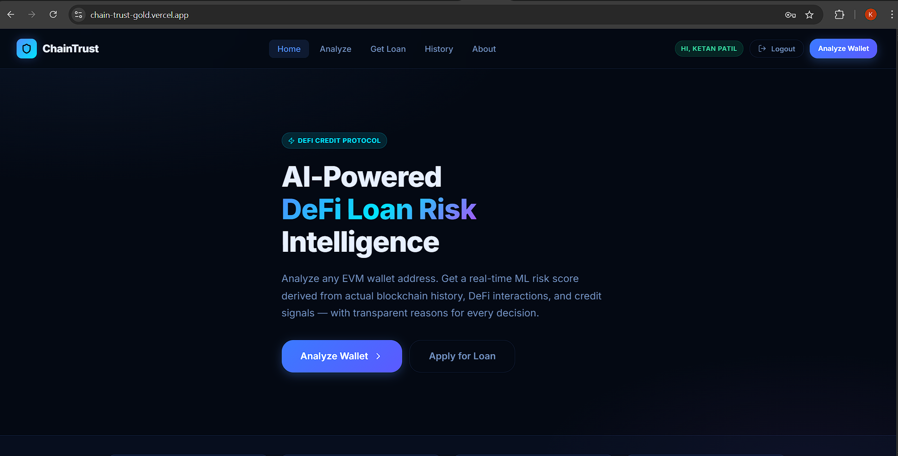

### Wallet Analyze
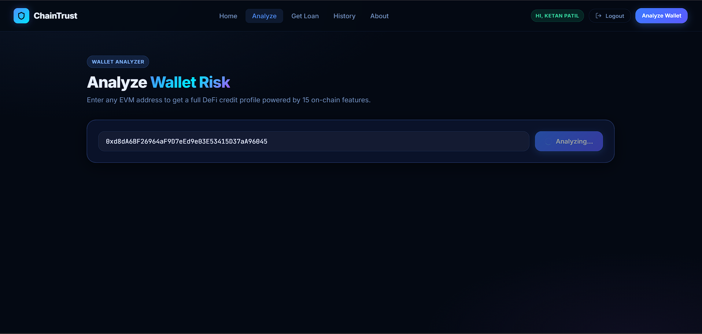
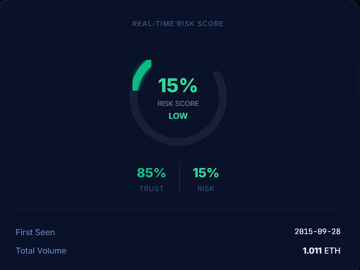
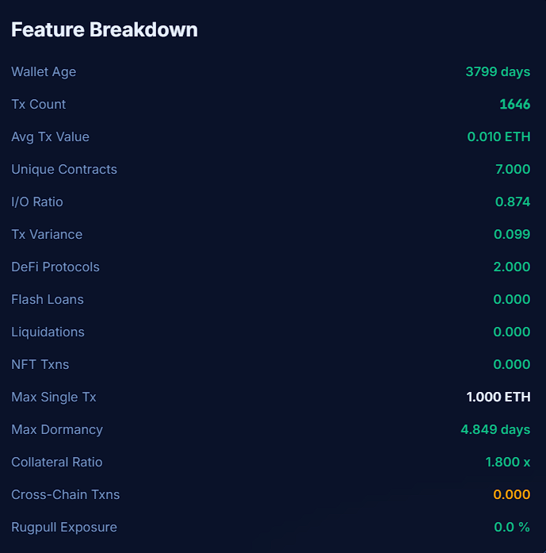
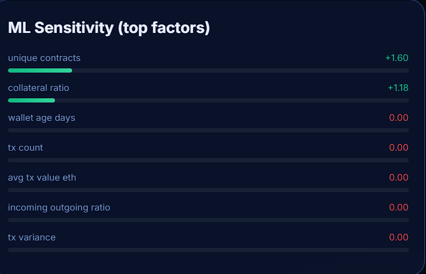

### Loan Decision
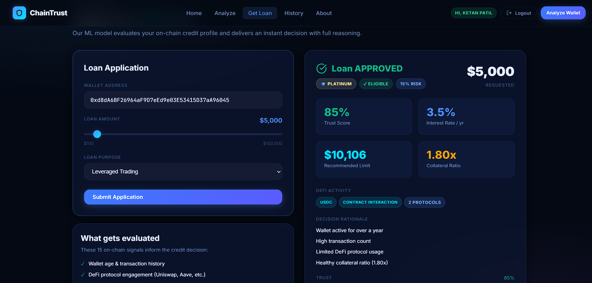

### History
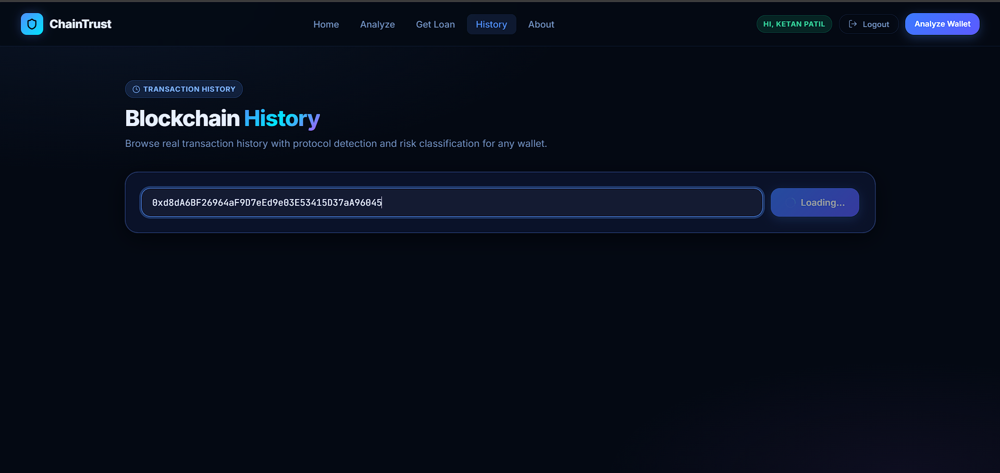
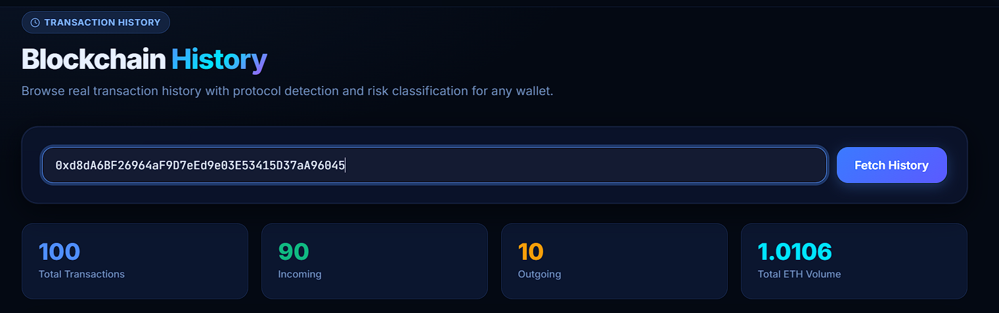
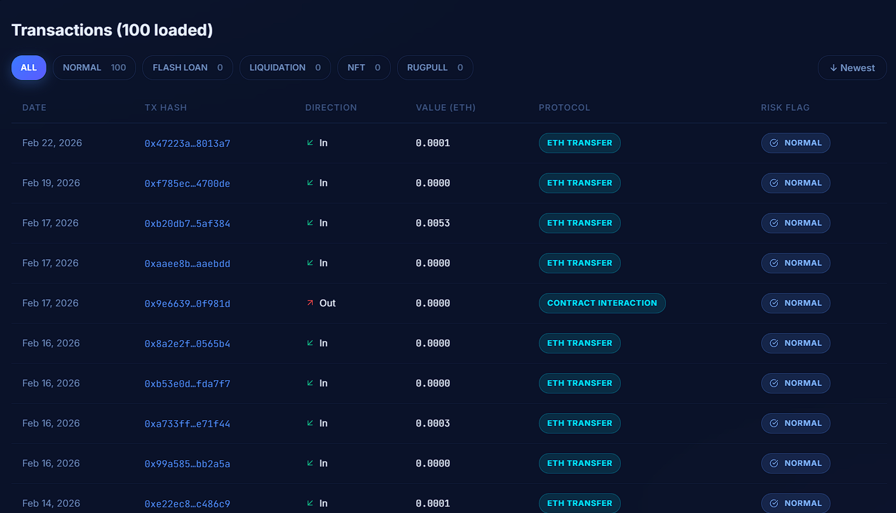

### About
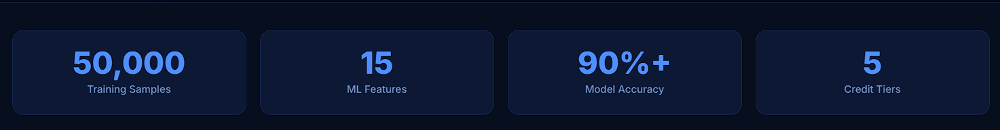
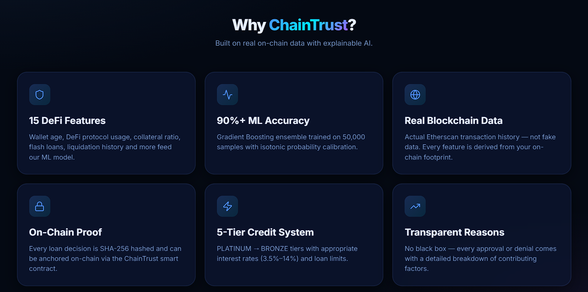

## System Architecture

```text
Frontend (React, Vercel-ready)
        |
        v
Backend API (Spring Boot)
   |            |              |
   v            v              v
PostgreSQL   ML Service     Ethereum (optional write)
               (FastAPI)       via web3j + RPC
```

Flow:
1. Frontend calls backend.
2. Backend fetches wallet history/features.
3. Backend requests ML prediction from `ml-service`.
4. Backend applies policy thresholds and hard rules.
5. Backend stores decisions in PostgreSQL.
6. Backend optionally writes a hashed loan decision to smart contract.
7. Labeled outcomes are exported for retraining.

## Tech Stack

| Layer | Technology | Purpose |
|---|---|---|
| Frontend | React 18, Axios, Recharts, Tailwind, Ethers.js | UI, charts, API calls, wallet tooling |
| Backend | Spring Boot 3.3.6, JPA, Validation, web3j, BCrypt | API, business logic, DB access, blockchain writes, auth |
| ML Serving | FastAPI, scikit-learn, numpy, joblib | Real-time risk scoring |
| ML Training | Python, pandas, scikit-learn | Model training/calibration and threshold export |
| Database | PostgreSQL (local Docker or Supabase Postgres in cloud) | Users, wallets, loan decision audit data |
| Blockchain | Solidity 0.8.17 + Hardhat + Sepolia/local node | On-chain decision/risk hash registry |
| Orchestration | Docker Compose | Local multi-service setup |

## External Services Used

These services are used by the project for source control, hosting, RPC, data, and wallet integration.

| Use Case | Service |
|---|---|
| Source code | GitHub |
| Frontend hosting | Vercel |
| Backend/ML hosting options | Render, Railway |
| Managed PostgreSQL | Supabase |
| Ethereum RPC providers | Infura, PublicNode |
| On-chain wallet transaction data | Etherscan API |
| Contract explorer | Etherscan (Sepolia) |
| Wallet extension | MetaMask |

## Repository Structure

```text
ChainTrust/
  backend/       # Spring Boot API + policy + persistence + blockchain writer
  frontend/      # React web app
  ml-service/    # FastAPI prediction service
  ml-train/      # model training and calibration pipeline
  contracts/     # Hardhat workspace + ChainTrust.sol
  scripts/       # helper scripts for deployment/bootstrap
  images/        # README screenshots
```

## Core Features

- Wallet risk analysis from real transaction history
- 15-feature ML risk scoring
- Explainable reasons + feature contributions
- Policy engine with tiers (`PLATINUM`, `GOLD`, `SILVER`, `BRONZE`, `REJECTED`)
- Dynamic interest and recommended loan limit
- Optional on-chain decision hash recording
- Training data capture via outcome labeling
- User auth + wallet linking

## API Overview

| Endpoint | Method | Description |
|---|---|---|
| `/wallet/{address}` | `GET` | Extract wallet features |
| `/wallet/{address}/history` | `GET` | Transaction history used for analysis |
| `/risk` | `POST` | Score risk from wallet features |
| `/loan/evaluate` | `POST` | Full decision: policy + ML + optional on-chain write |
| `/loan/outcome` | `POST` | Mark previous decision as `REPAID` or `DEFAULTED` |
| `/loan/training-data` | `GET` | Export labeled data for retraining |
| `/auth/register` | `POST` | Register account |
| `/auth/login` | `POST` | Login |

ML service endpoints:
- `/health`
- `/predict`
- `/docs`

## Database Tables

Main persisted entities:
- `loan_decisions`
- `app_users`
- `user_wallets`

## Local Setup (Recommended)

### Prerequisites

- Docker Desktop
- Node.js 18+
- Python 3.10+
- Java 17+
- Maven

### 1) Configure environment

```bash
cp .env.example .env
```

Fill required keys in `.env`:
- `ETHERSCAN_API_KEYS`
- `ETH_RPC_URL`
- `CONTRACT_ADDRESS` (if blockchain enabled)
- DB and backend/frontend URLs if deploying remotely

### 2) Start all services

```bash
docker compose up --build
```

### 4) Optional: retrain model artifacts

Use this after you have labeled outcomes (`/loan/outcome`) available:

```bash
python ml-train/train_model.py --source api
```

Generated files:
- `ml-service/model/model.pkl`
- `ml-service/model/policy_thresholds.json`
- `ml-service/model/metrics.json`

## Blockchain Setup

### Option A: Local Hardhat chain

PowerShell:
```powershell
.\scripts\start_hardhat_local_chain.ps1
```

Bash:
```bash
./scripts/start_hardhat_local_chain.sh
```

Manual:
```bash
cd contracts
npm install
npm run compile
npm run node
```

In another terminal:
```bash
cd contracts
npm run deploy:local
```

Use deployment output from `contracts/deployments/` in root `.env`.

### Option B: Sepolia deployment

Set in `.env` (or `contracts/.env`):

```env
HARDHAT_SEPOLIA_RPC_URL=<SEPOLIA_RPC_URL>
HARDHAT_DEPLOYER_PRIVATE_KEY=<private_key_without_0x>
HARDHAT_ETHERSCAN_API_KEY=<etherscan_key>
```

Deploy:
```bash
cd contracts
npm run deploy:sepolia
```

Automated PowerShell workflow:
```powershell
.\scripts\deploy_sepolia_and_wire_env.ps1
```

## Deployment Guide

### Frontend (Vercel)

Set project root to `frontend` and configure:
- `REACT_APP_BACKEND_URL=<public_backend_url>`

### Backend + ML

Deploy `backend` and `ml-service` to a host like Render/Railway.

Important backend env vars:
- `SPRING_DATASOURCE_URL`
- `SPRING_DATASOURCE_USERNAME`
- `SPRING_DATASOURCE_PASSWORD`
- `ML_SERVICE_URL`
- `ETHERSCAN_API_KEYS`
- `ETH_RPC_URL`
- `BLOCKCHAIN_ENABLED`
- `CONTRACT_ADDRESS`
- `BLOCKCHAIN_PRIVATE_KEY`

### Database

- Local: Docker `postgres:15`
- Cloud: Supabase Postgres (see `.env.sepolia.example`)

## ML Retraining Workflow

1. Use `/loan/evaluate` in normal product flow.
2. When outcome is known, call `/loan/outcome` with `REPAID` or `DEFAULTED`.
3. Export/consume labeled data from `/loan/training-data`.
4. Retrain:
   ```bash
   python ml-train/train_model.py --source api
   ```
5. Redeploy/restart backend + ml-service to use new artifacts.

## Useful Commands

```bash
# start local stack
docker compose up --build -d

# backend tests
cd backend && mvn -q test

# frontend dev
cd frontend && npm install && npm start

# ml service dev
cd ml-service && pip install -r requirements.txt && uvicorn main:app --reload --port 8000

# bootstrap labeled outcomes locally
python scripts/collect_labeled_outcomes.py --backend-url <BACKEND_URL> --target-per-class 10
```

## Security Notes

- Do not commit private keys or production secrets.
- Store only hashes/decision references on-chain; avoid PII on-chain.
- Rotate API keys if exposed.
- Use secure managed secrets in cloud deployments.

## Contributors

1. Ketan Patil: deployment, database, backend, frontend.
2. Aamer Khan: deployment, blockchain, ML, DevOps, smart contracts.
